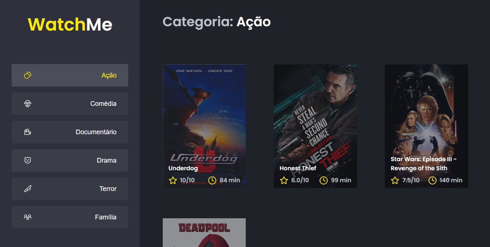

# Componentizando a aplicação 

Nesse desafio, você deverá criar uma aplicação para treinar o que aprendeu até agora no ReactJS

Essa é uma aplicação em que o principal objetivo foi refatorar uma página para listagem de filmes de acordo com gênero. 

A aplicação já estava totalmente funcional mas grande parte do seu código está diretamente no arquivo `App.tsx`. Para resolver isso da melhor forma, é necessário dividir a aplicação em **pelo menos** duas partes principais: sidebar e o conteúdo principal que possui o header e a listagem de filmes.

- A aplicação possui apenas uma funcionalidade principal que é a listagem de filmes;
- Na sidebar é possível selecionar qual categoria de filmes deve ser listada;
- A primeira categoria da lista (que é "Ação") já deve começar como marcada;
- O header da aplicação possui apenas o nome da categoria selecionada que deve mudar dinamicamente.

### Fake API com JSON Server

Nesse projeto foi utilizado o JSON Server para simular uma API que possui as informações de gêneros e filmes. 

### Para executar basta ir até a pasta do projeto e executar: 
    yarn 
    yarn server

A partir disso sera iniciada uma fake API com os recursos /genres e /movies em localhost na porta 3333 a partir das informações do arquivo server.json localizado na raiz do seu projeto. Acessando essas rotas no seu navegador, é possível ver o retorno das informações já em JSON.

Para consumir essas informações foi usada a biblioteca Axios.

# O que foi editado na aplicação?

Levando em conta que o problema era que boa parte do código estava no arquivo APP, optei por criar outros 2 componentes: SideBar e Content, além disso, criei também um arquivo que exporta as interfaces (InterfacesWatchMe)

 

# Resultado

O site continua com mesmo layout, a única coisa alterada foi o código.
 

## [Video demostrativo](https://www.youtube.com/watch?v=Kdj1KzkDiP4&feature=youtu.be&ab_channel=EmanuelVieira)